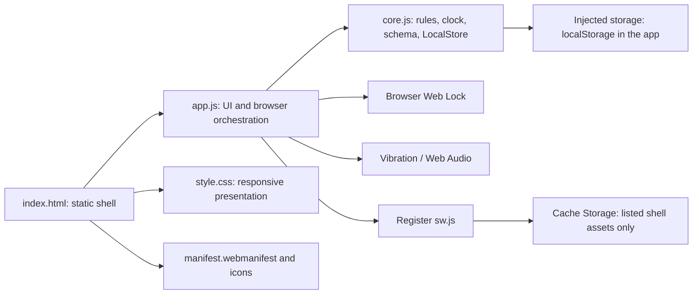
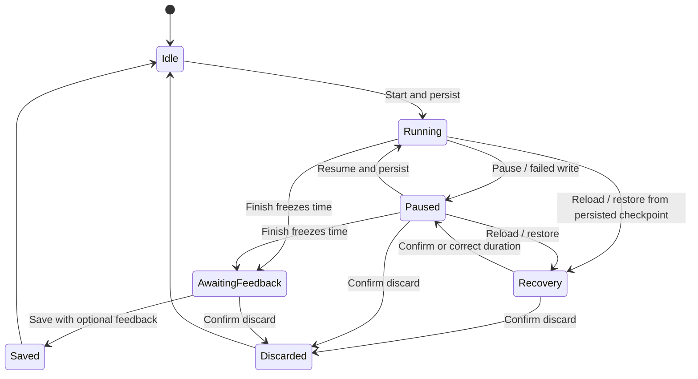

# Reading Endurance

A small reading timer that helps you start with two minutes or work toward a
chosen duration. Read your own physical book or use another ebook reader; this
app does not contain books. It works in a browser, with optional home-screen
installation. All reading data stays in that browser, with no account or cloud sync.

For use, start with the [reader guide](#reader-guide) and [first read](#first-read).
The [contributor reference](#run-and-validate) covers development commands,
architecture, and lifecycle details; read it before changing behavior.
[AGENTS.md](AGENTS.md) contains enforceable contributor rules for the whole
repository; there are no nested instruction files.

## Contents

For readers:

- [Reader guide: open the app, settings, backups, and recovery](#reader-guide)
- [First read](#first-read)
- [Goals and non-goals](#goals-and-non-goals)

Contributor reference:

- [Run and validate](#run-and-validate)
- [Architecture and repository layout](#architecture-and-repository-layout)
- [Application lifecycle and control flow](#application-lifecycle-and-control-flow)
- [Timing and recovery](#timing-and-recovery)
- [Training replay](#training-replay)
- [Honest progress](#honest-progress)
- [Data model and persistence](#data-model-and-persistence)
- [Network, offline shell, and installation](#network-offline-shell-and-installation)
- [Testing and development workflows](#testing-and-development-workflows)
- [Debugging](#debugging)
- [Platform findings and remaining checks](#platform-findings-and-remaining-checks)
- [Known limitations and roadmap status](#known-limitations-and-roadmap-status)
- [Glossary](#glossary)

## Reader guide

This repository supplies source files. It does not document a hosted app address,
an app-store download, or a packaged installer. You can run the files on a computer
as described below. Phone use needs an HTTPS web host; the computer's local server
alone does not provide phone access.

Use a current browser with JavaScript and local storage enabled. The main layout
target is an Android phone in portrait or landscape, with desktop use also
supported. The app checks the browser features it needs and explains when they
are unavailable. [Real-phone checks are still outstanding](#platform-findings-and-remaining-checks).

### Open on a computer

1. Obtain the source from the
   [GitHub repository](https://github.com/patrickjohnson3/reading-endurance), using
   **Code → Download ZIP**, and extract it, or use an existing checkout.
   [GitHub's download instructions](https://docs.github.com/en/repositories/working-with-files/using-files/downloading-source-code-archives)
   explain that menu.
2. With Python 3 installed and available as `python3`, open a terminal in the
   extracted folder containing `index.html` and `package.json`, then run:

   ```sh
   python3 -m http.server 8000 --bind 127.0.0.1
   ```

3. Leave that terminal running and open [http://localhost:8000](http://localhost:8000)
   in a browser **on the same computer**. Follow [First read](#first-read).
   Stop the server with Ctrl+C when done; run it again to reopen the app.

Node, npm, Chrome's test tools, and the validation commands below are only needed
for development. Do not open `index.html` directly: a local file does not provide
the browser environment the app requires.

### Use on a phone, install, and go offline

To use it on a phone, someone must serve the application files at an **HTTPS
address reachable from that phone**. This repository includes no hosting or
certificate setup. If you only have a phone, you will need that address first.
The `localhost` address above belongs to the computer, and changing it to a plain
HTTP local-network address does not meet the app's browser requirements. For the
person hosting it, see [Network, offline shell, and installation](#network-offline-shell-and-installation).

Open the HTTPS address in your phone's browser and follow [First read](#first-read).
Use the browser's **Install app** or **Add to Home screen** option if offered;
installation is optional. The first visit needs a connection. With no read open,
**Settings → Offline and installation** shows whether the app is ready to reopen
offline. Offline access depends on the browser retaining its cached files.

When an update is ready, finish and save your read, close all app tabs/windows,
and reopen. Updates wait for those tabs to close and retain local reading data.

### Settings, history, and backups

After saving or discarding a read, the navigation offers:

- **Read** to choose a mode and start again. Train shows a recommendation with an
  override; Just read has no duration target.
- **Progress** for reading totals and history. Each saved read has **Edit feedback**
  and **Delete…** controls. Edits and deletions recalculate the training recommendation.
- **Settings** to change **Reading cue**, preview it, and **Save cue setting**, or
  enter a new recommendation and select **Set training target**. Cues can stay Off;
  unavailable vibration never switches to sound automatically.

Keep a backup with **Settings → Your local data → Export JSON** if your history
matters to you. Use the same browser, device, and web address to return to your
history. Different browsers and devices do not share it; changing the site's
protocol, host, or port also changes where data is stored. Browser data clearing
or eviction can remove it. **Import JSON…** replaces local settings, history, and any
pending read after confirmation; export the current data first if you want to keep
it. **Clear all local data…** also removes all of those items after confirmation.

### Interruptions and common problems

- **Pause** excludes paused time and marks the read interrupted. You can **Resume**
  or **Finish** while paused. Interrupted reads count toward total time, but do not
  change training or set longest-engaged records.
- If an unfinished read reappears after closing or reloading, confirm or correct
  the minutes you actually read and choose **Recover as paused**, or discard it.
  Time while the app was closed is not added. Recovered reads stay marked uncertain
  and interrupted. After **Finish**, duration is frozen; save your feedback before
  closing because unsubmitted answers are not restored on reload.
- If saving fails, keep the page open, check that your browser allows local storage,
  choose **Retry storage**, then submit the unsaved form again. An export does not
  include answers still in the form. Do not clear browser data to fix a save error
  unless you intend to remove your local history.
- If the app says **Open in another tab**, close the other Reading Endurance tab
  or window, then choose **Try again**. Only one can manage reads at a time.

## Goals and non-goals

The reader's activity happens outside this app. The app helps them start, sustain,
and record a read without requiring an account, book entry, or page numbers.
Initiation and training remain separate choices:

| Mode in the UI | Stored value | Commitment |
| --- | --- | --- |
| Two-minute start | `start` | Two active minutes meets the starting commitment; timing continues until Finish. |
| Train | `train` | Show an honest recommended duration and allow an override before starting. |
| Just read | `free` | Untargeted timing with optional cue and feedback. |

No target automatically stops a read or switches its mode. Short reads are recorded
neutrally, and missed days have no penalty. Two minutes is a product design choice,
not a scientifically established threshold. Feedback is self-reported engagement,
not comprehension or a measurement of attention capacity.

The documented scope excludes a backend, accounts, cloud sync, telemetry, text
hosting, and manufactured starter history. Preserve the local-only, dependency-free
runtime. The app does not claim cognitive improvement, medical benefit, or that a
cue caused a reader to continue. Native background scheduling is outside this web
implementation; its limitations are disclosed rather than hidden behind a wrapper.

## First read

Choose a cue (or Off), optionally preview it, and pick an initial Train target.
“Not sure” uses 10 minutes. For a cue, keep this page visible and the screen
unlocked; browser or device settings may still suppress it. The app does not keep
the screen awake, and timing works with cues Off.

Save setup, leave Two-minute start selected, and press
**Start reading**. Put the device down and read your own book. Two active minutes
meets the starting commitment; keep reading until you press **Finish**. Choose an
optional engagement report or **Save without feedback**.

Train displays a recommendation and a 2–60 minute override before starting.
Just read has no target. Neither a target nor a cue stops any session. A target
cue is separately selected for each Train read and defaults off. Confidence is
one short pulse/tone; target is two short pulses/tones. At a two-minute target,
confidence takes precedence; disabling confidence permits the target cue instead.

## Run and validate

This section and the architecture sections below are the contributor reference.
Readers can use the Python command in [Open on a computer](#open-on-a-computer)
without installing Node or running tests.

From this directory, with Python 3 and Node 22.8+ (validated with Node 24):

```sh
npm start
# Open http://localhost:8000
npm run check
npm run test:ui
```

No `npm install` is needed. `npm run check` runs syntax checks and the pure-rule
tests using Node's built-in test runner. `test:ui` additionally requires Chrome
(`google-chrome` on PATH, or set `CHROME_BIN`). It starts a loopback-only server and
an isolated temporary headless browser, then removes the profile, including after
startup failures. It uses Node's built-in WebSocket and the Chrome DevTools
Protocol; no test packages are needed.
Set `SCREENSHOT_DIR=/tmp/reading-endurance-review` to retain screenshots.

| Command | What it does |
| --- | --- |
| `npm start` | Serves the checked-in files with Python's HTTP server, bound to `127.0.0.1:8000`. |
| `npm test` | Runs `tests/*.test.js` with Node's built-in runner and test isolation disabled. |
| `npm run check` | Checks syntax in `app.js`, `core.js`, and `sw.js`, then runs the unit tests. |
| `npm run test:ui` | Starts its own temporary server and Chrome profile and runs the browser harness; `npm start` is not required. |

There is no build step, generated application bundle, package installation, or
separate lint, format, or type-check command. `package.json` is private and supplies
ES-module configuration and development scripts; it does not define a distributable
npm package. No CI workflow or deployment automation is checked in.

Use HTTPS or localhost. Web Locks and service workers require a secure context.
The MVP requires Web Locks and secure ID generation (`crypto.randomUUID()`) to
manage local state safely across tabs. The app checks these before creating an ID
and gives a visible explanation on unsupported browsers or insecure origins.
Opening `index.html` directly as a file is not a supported way to run it.
[Phone use requires an HTTPS host](#use-on-a-phone-install-and-go-offline);
nothing in this project publishes or deploys a site.

## Architecture and repository layout

The browser loads native ES modules directly. There is no framework, router, server
application, or dependency-injection container. Product rules and browser effects
have one boundary: `app.js` imports `core.js`; `core.js` never imports the UI or
accesses browser globals. This makes timing and progression independently testable
with explicit clocks and storage, while the UI owns device-dependent behavior.



The arrows show dependencies or API calls. The service worker does not execute
the page. Reading state lives in localStorage; the worker caches application files.
Keeping those stores separate prevents offline installation from being mistaken
for a backup or a background timer.

| Path | Responsibility |
| --- | --- |
| [index.html](index.html) | Entry point, metadata, stylesheet/module links, navigation, skip link, page status/error regions, and native dialog container. |
| [app.js](app.js) | View templates, delegated form/click/change/input events, Web Lock ownership, persistence transactions, cue APIs, focus management, and lifecycle hooks. |
| [core.js](core.js) | Deterministic replay/statistics, session transitions, schema validation/normalization, and the injected storage adapter. |
| [style.css](style.css) | Light visual identity, typography, controls, responsive and landscape layouts, safe-area insets, focus indicators, and reduced-motion rules. |
| [sw.js](sw.js) | Scoped, versioned cache of explicit app-shell URLs. |
| [manifest.webmanifest](manifest.webmanifest) | Relative app identity, start URL/scope, standalone display mode, colors, and install icons. |
| [icons/](icons/) | Checked-in SVG and 192/512-pixel PNG assets; no icon-generation script is tracked. |
| [tests/core.test.js](tests/core.test.js) | Node tests for rules, clocks, recovery, schema, and storage errors. |
| [tests/fixtures/reading-endurance-v1.json](tests/fixtures/reading-endurance-v1.json) | Frozen synthetic v1 export covering saved reads, manual changes, and a recovered pending read. Compatibility evidence independent of current constructors. |
| [tests/browser.mjs](tests/browser.mjs) | Chrome DevTools Protocol harness, temporary HTTP server, controlled clocks, UI assertions, screenshots, and offline/update checks. |
| [package.json](package.json) | Private package metadata, native ES-module mode, and canonical development commands. |
| [.gitignore](.gitignore) | Excludes dependency directories, test results, and logs. |
| [README.md](README.md), [AGENTS.md](AGENTS.md) | Behavior/developer reference and contributor constraints, respectively. |

There are no database migrations, generated build directories, runtime dependency
files, or separate documentation tree. The PNGs are source assets to retain.

### Major components

| Component | Contract |
| --- | --- |
| `ordered()` | Sort a copy of events by timestamp, order, and ID without mutating the input array. |
| `recommend()` | Replay saved sessions and manual target events; return `{ target, comfortableCount, countTarget }` without mutating history. |
| `statistics()` | Compute totals, separate engaged records, and continuation counts from completed records; accepts an explicit date for tests. |
| `newSession()`, `ReadingClock` | Create a live session and mutate its timing/deadline state using supplied monotonic and wall timestamps. |
| `recoverSession()`, `completeSession()` | Produce recovered or completed data without adding crash downtime or duplicating completion by ID. |
| `validateData()`, `LocalStore` | Validate and normalize the versioned JSON model before reading/writing the injected storage interface. |
| `render()`, `renderReadingInPlace()` | Choose the visible state, replace main content, and preserve reading control focus/scroll when required. |
| `persist()`, `load()`, `acquire()` | Coordinate writes, failure UI, loading, and exclusive ownership. |
| `prepareAudio()`, `deliverCue()`, `stopCue()`, `tick()` | Prepare sound within a gesture, request punctual cues, cancel queued output, and sample/checkpoint elapsed time. |

UI views are string templates rendered into `#main`. Delegated document listeners
continue to work when that content is replaced. Navigation is an in-memory
`read`/`progress`/`settings` selection, not a URL route; no deep-link protocol is
implemented. Rendering and event selectors are therefore also contracts with the
browser tests.

## Application lifecycle and control flow

### Startup and ownership

1. `index.html` loads `app.js`, which imports `core.js` and attaches handlers.
2. Startup checks for Web Locks and `crypto.randomUUID()`. Unsupported contexts
   show an explanation without creating reading data.
3. The page requests the origin-wide `reading-endurance-v1` Web Lock with
   `ifAvailable: true`. A non-owner shows a retry screen instead of editing.
4. The owner creates `LocalStore(window.localStorage)`, reads and validates the
   stored JSON, and normalizes an unavailable selected cue to Off through a write.
5. The renderer prioritizes corrupt data, recovery, pending feedback, active reading,
   first-run setup, then the selected idle view. Active state hides idle navigation.
6. Service-worker registration proceeds separately if the API is available. Failure
   to install the offline shell does not disable the loaded page's reading flow.

The lock name equals the storage key because both data and lock ownership are
origin-wide. Two installations at different paths on the same origin share the
reading store and compete for that lock, even though their shell caches are scoped
by installation path. The lock covers idle editing as well as active reads.

### Session state



Only `running`, `paused`, and `awaiting-feedback` are persisted active-state
values. Idle/discarded mean `active: null`; saved means a record in `sessions`.
Recovery is a UI gate, not another stored enum. A failed Finish write still freezes
the in-memory duration and shows pending feedback, but that transition is not
durable until a later write succeeds.

### A read from Start to Save

Start collects mode, chosen target, recommendation, and cue options. Sound
preparation starts within the button gesture; after that asynchronous step, the
handler rechecks ownership, existing active state, and whether the form still
belongs to the page. It writes the new session before creating the live clock.

The 250-millisecond callback samples timestamps, repaints the timer, and checkpoints
approximately every five seconds while running. Paused callbacks leave the duration
and saved checkpoint unchanged; Pause, Resume, Finish, and lifecycle events still
write explicitly. Deadline changes and timing uncertainty also trigger writes.
Cue attempts are recorded before delivery; a failed write prevents delivery.
These callbacks do not count seconds.

Finish samples once with cues disabled, freezes `activeMs` and `finishedAt`,
cancels output, attempts persistence, and renders feedback. `completeSession()`
clones the accepted model, including signal objects, into an independent Save
candidate. Only a duration correction needs a preliminary copy before completion.
Only a successful write replaces the app's model and announces success. Editing
feedback follows the same clone/validate/write boundary. History changes are
reflected by replay, rather than patching a cached recommendation.

### Browser lifecycle events

| Event | Current handling |
| --- | --- |
| `visibilitychange` | Sample/checkpoint without cue delivery; cancel output when hidden. Returning does not resume suspended audio automatically. |
| `freeze` | Sample/checkpoint without cues and stop output. |
| `resume` | Sample without emitting a late cue. |
| `pagehide` | Sample/checkpoint, close dialogs, stop output, clear the live clock, and release ownership. |
| `pageshow` with `persisted` | Reacquire the lock and reload data rather than trusting the restored document's old model. |
| Reload/new document | Load persisted active state; require recovery for running/paused state, or show frozen pending feedback directly. |

Browser support and delivery of lifecycle events vary. Persisted checkpoints and
explicit recovery remain necessary even with these hooks.

Successful Pause/Resume transitions keep the reading viewport and focus the
corresponding Resume/Pause control. Finish opens feedback at the top of the page.
Automatic timing warnings retain an available focused reading control, using
Finish if storage failure makes Pause/Resume unavailable. Timing uncertainty
updates the polite status region once; the ticking timer stays quiet.
Finishing freezes duration immediately, even if feedback is supplied later.
Double completion is idempotent by session ID. State transitions attempt persistence
immediately; running callbacks attempt checkpoints at five-second intervals and lifecycle
events also checkpoint. Background scheduling and storage can prevent those writes.
Rotation changes no timing state.

## Timing and recovery

Within one live document, elapsed time is the sum of monotonic `performance.now()`
differences during active intervals. Interval callbacks only repaint and
checkpoint; their count does not determine duration. Paused time is excluded.
Wall timestamps record calendar dates and checkpoints, not live elapsed seconds.

On reload/unclean close, the default recovery duration is **only the last saved
active duration**. Hours since a checkpoint are never added automatically. The
reader must explicitly recover or discard and can correct the duration. Recovery
starts paused, marks uncertainty and interruption, suppresses all later cues, and
excludes that read from progression and longest engaged records. A durably finished
read reloads into pending feedback with the same frozen duration.

On some platforms the monotonic clock does not advance through system sleep. A
wall/monotonic discrepancy over two seconds marks the interval uncertain, while
preserving monotonic arithmetic. The reader must confirm/correct duration before
saving. This also handles device wall-clock adjustments without inflating or
reversing duration. Remaining cues are suppressed because an apparent future
crossing could already be stale. Timing ambiguity is retained in history.

Confidence deadline crossing and delivery attempted are separate persisted flags.
A deadline can pass with cues off or with no delivery. A cue is attempted at most
once, only while visible/running on a punctual callback (gap ≤2 seconds and ≤1.5
seconds after deadline), after persisting its attempt.
The clocks are checked again immediately before output. If a successful write
outlasts the delivery window, no cue is requested: the deadline stays passed and
the app clears the attempt flag and tries to persist that correction.
Finish, lifecycle return, delayed callbacks, and recovery never replay a cue.
The app does not infer that a
request was felt or heard. A failed checkpoint write pauses the read; retry is
explicit. Failed final saves keep pending feedback and do not claim success.

## Training replay

This deterministic product heuristic uses completed Train reads with feedback.
It does not measure attention capacity, comprehension, cognition, or health.

For an uninterrupted, certain read against its actual chosen target:

- Comfortable + reached target: first success holds; two consecutive successes
  at that target add two minutes, capped at 60.
- Challenging but engaged + reached target: hold chosen target, reset count.
- Comfortable/challenging + early stop: hold chosen target, reset count.
- Lost the thread: reset; use supplied engagement estimate floored to whole
  minutes, bounded to 2 and no more than chosen target. With no estimate, subtract
  two minutes from chosen target, bounded to 2.

Interrupted, uncertain, externally stopped, unrated, and untargeted reads hold the
existing recommendation and break the success count. An eligible override holds
its chosen target and begins its own count; it never borrows successes from a
different target. Prescribed and chosen targets are stored separately. Rest days
do nothing. Manual changes are explicit target-change events and reset the count.

Replay sorts completed reads by **frozen finish timestamp**, manual changes by
their timestamp, then by the persisted unique integer `order` for equal times
(and ID as a final stable tie-break). Edits keep timestamps/order; deletes leave
order gaps. Every recommendation is recomputed from remaining history and manual
changes. Clock-adjusted calendar ordering is deterministic, not an inferred
biological timeline.

## Honest progress

Weekly totals use local calendar weeks beginning Monday and include every saved
completed read, including unrated or interrupted ones. Unfinished reads do not
enter totals. Longest engaged intervals include only certain, unpaused reads
reported Comfortable or Challenging but engaged, with separate records for each.
An uninterrupted timed interval is not proof of uninterrupted attention.

The chart shows the latest 30 saved reads chronologically with outcome labels and
striped interruption markers. Accessible history contains every saved read.
History action names and deletion confirmations include the read's duration,
mode, and timestamp.
Observed continuation appears once there are two eligible reads: numerator is
completed reads reaching 12 active minutes; denominator is completed reads
reaching two active minutes. It includes cues off, suppressed, or unavailable.
Percentages appear only for five or more eligible reads. It is not cue efficacy.

## Data model and persistence

There is no SQL database, IndexedDB store, backend schema, or migration framework.
`LocalStore` serializes one versioned JSON document under localStorage key
`reading-endurance-v1`. Its injected interface needs only `getItem(key)` and
`setItem(key, value)`; unit tests provide an in-memory implementation.
The key's `v1` suffix is historical: it identifies the reading store and its
matching Web Lock, independently of the document's schema version. A schema
upgrade must retain this identity unless it explicitly discovers old data and
coordinates with older clients. Renaming the key alone would make old data appear
absent and create a different lock. No migration is implemented while v1 remains
the only supported format.

`emptyData()` produces this valid empty document. It is a schema example, not
starter reading history:

```json
{
  "version": 1,
  "nextOrder": 1,
  "settings": {
    "setup": false,
    "initialTarget": 10,
    "cue": "off"
  },
  "sessions": [],
  "targetChanges": [],
  "active": null
}
```

| Root field | Meaning |
| --- | --- |
| `version` | Exactly `1`; unsupported versions are rejected. |
| `nextOrder` | Positive safe integer allocated when saving a session or manual target change. |
| `settings.setup` | Whether first-run setup has been saved. |
| `settings.initialTarget` | Whole minutes, 2–60, used as the replay starting point. Setup offers 10, 20, 30, 45, 60, or Not sure (10). |
| `settings.cue` | `off`, `vibration`, or `sound`. Empty storage uses Off; setup offers vibration if the API exists. |
| `sessions` | Completed session records; maximum 50,000 accepted by validation. |
| `targetChanges` | Explicit manual recommendation events; maximum 50,000 accepted by validation. |
| `active` | One recoverable session or `null`. Pending feedback still occupies this slot. |

### Session records

Active and completed sessions share these fields:

| Field | Type and meaning |
| --- | --- |
| `id` | Nonempty string up to 120 characters. The app generates UUIDs; imported IDs need not be UUIDs. |
| `mode` | `start`, `train`, or `free`. |
| `startedAt`, `finishedAt` | Wall-clock epoch milliseconds. `finishedAt` is null until Finish. |
| `activeMs` | Finite, nonnegative milliseconds, no larger than `Number.MAX_SAFE_INTEGER`; excludes paused time. The 60-minute target ceiling does not cap it. |
| `interruptions` | Nonnegative safe integer; Pause increments it. Recovery/corrected uncertain reads retain at least one. |
| `uncertain` | Boolean retained after recovery or timing ambiguity; excludes progression and continuous records. |
| `prescribedTarget` | The recommendation at Start, whole minutes 2–60 for Train; null otherwise. |
| `targetMinutes` | The actual chosen Train target, whole minutes 2–60; null otherwise. |
| `cue` | Cue channel captured for this read; settings changes do not rewrite old sessions. |
| `confidenceEnabled` | Whether this read requested the optional two-minute confidence cue. |
| `targetCue` | Whether this Train read requested the separate target cue; false in untargeted modes. |
| `confidence`, `targetSignal` | Deadline/delivery flag objects, described below. |

Active-only fields are `state` (`running`, `paused`, or `awaiting-feedback`),
`owner` (the page's generated ID), and `checkpointAt` (wall timestamp).
An awaiting-feedback active record has a frozen finish timestamp; running/paused
records have `finishedAt: null`. The owner ID is metadata, not a replacement for
the browser lock.

Completion removes those three active-only fields and adds:

| Field | Type and meaning |
| --- | --- |
| `kind` | Exactly `session`, identifying the event during replay. |
| `order` | Positive safe integer allocated from `nextOrder`. |
| `outcome` | `comfortable`, `challenging`, `lost`, `external`, or null for no feedback. |
| `engagedMinutes` | Null, or a finite nonnegative self-reported estimate for `lost`, bounded to the recorded active duration. Skipped estimates remain null. |

The estimate can be fractional; training floors it later. Duration comparisons
allow 0.001 milliseconds of floating-point tolerance. Timestamp validation accepts
finite nonnegative values up to JavaScript's representable date limit
(8,640,000,000,000,000 milliseconds). The recovery/correction UI separately limits
entered durations to 0–10,080 minutes; this is not the schema's session ceiling.

### Deadline flags and manual changes

Both signal objects contain three booleans:

| Flag | Meaning |
| --- | --- |
| `passed` | Active time reached the deadline, including when the channel was Off or delivery was missed. |
| `attempted` | The app recorded a delivery attempt; must imply `passed`. It does not confirm vibration or audible output. |
| `suppressed` | Recovery or timing ambiguity prevents later delivery for this read. |

A manual change has `{ kind: 'target', id, at, order, target }`: `at` is a wall
timestamp, `target` is whole 2–60 minutes, and ID/order constraints match completed
records. Session and manual-event IDs and orders are unique across both arrays;
every event's order is less than `nextOrder`. An active ID cannot duplicate a
saved/manual event. Deletion leaves order gaps.

Recommendations, comfortable-success counters, totals, chart widths, and longest
records are derived, not persisted. In-memory view/mode selection, the live clock's
monotonic baseline, audio nodes, lock state, error state, and unsaved form values
also do not belong to the JSON schema.

### Validation, transactions, and data tools

`validateData()` checks required values and relationships and returns only known
fields. `LocalStore.load()` parses and validates; absent data returns an empty
model, while unreadable data throws. `LocalStore.save()` validates, normalizes,
serializes, and writes before returning. There is no automatic migration or
fallback that overwrites an unsupported document.

Most form actions clone `db` and call `persist(candidate)`; a failed candidate
write leaves the accepted model unchanged and the entered form available.
Live clock transitions mutate the active in-memory object before writing; on a
failure, it can be newer than storage. An affected running read pauses, and the UI
shows a storage error rather than claiming durability. Retry saves the current
model; failed form transactions still need to be submitted again.

An open dialog exposes status, errors, retry, and export controls inside the modal,
since the page behind it is inert. Dialogs close before ownership is released;
clear-data confirms and checks ownership at the write, including unreadable-data
reset. Import, discard, delete, and clear actions require explicit confirmation.

Normal export downloads the current in-memory model as
`reading-endurance-v1.json`. It includes accepted records and any pending read,
but **does not include unsaved feedback edits or preparation form values**. For
unreadable data, export retrieves the original stored string as
`reading-endurance-original-data.json`; that file may not be valid JSON.
If storage cannot be read at all, that export can also fail.

Import reads the selected file locally, rejects files above 20,000,000 bytes,
parses/validates before showing Replace confirmation, and writes only on confirmation.
Only the most recently selected file can show a confirmation or read/validation error;
an older file read completing later is ignored.
Unknown fields are removed. Import replaces the complete store; it does not merge.
Imported running/paused reads require recovery; pending finished reads show feedback.
Deleting a read or editing/removing its feedback recalculates training from remaining
history. Clear writes a fresh empty document and returns to setup.

Local storage is origin/browser/profile-specific and can be lost to browser data
clearing, eviction, private browsing, uninstall behavior, or device loss. Offline
caching does not back up reading history. Export regularly if the data matters.
No persistent-storage guarantee or cloud backup is implied.

## Network, offline shell, and installation

The application has no custom network protocol, API endpoint, authentication
exchange, WebSocket connection, or reading-data upload. Its requests are static
same-origin HTTP(S) resources and browser-managed service-worker checks. Fonts and
cue sounds require no downloads: typography uses system fonts and sound is synthesized
with Web Audio. The browser harness's loopback WebSocket is a development-only CDP
connection, not an application service.

The host serves the repository's application files directly, retaining the relative
paths from `index.html`, module imports, the manifest, and the worker. The test
server explicitly supplies HTML/JavaScript/CSS/manifest/SVG/PNG MIME types; there is
no production server configuration in the repository. Keep credentials, real
reading exports, and private test artifacts out of the served source tree.

The service worker caches only the listed shell URLs. Cache names include the
application scope; cleanup never touches another application's caches. No
`skipWaiting`, forced reload, notifications, or timer worker is used. An update
waits until all controlled app tabs close; pending state stays in local storage.
Increment the cache version in `sw.js` when releasing changed shell files, so
installed clients receive a coherent new shell. Offline launch requires a
successful first installation online. No offline guarantee is made if storage is
cleared or installation fails.

### Cache and update contract

At present, `SHELL` contains the scope root, `index.html`, `style.css`, `app.js`,
`core.js`, `manifest.webmanifest`, and all three icons. `sw.js` itself is checked
by the browser's worker update mechanism, not included in that asset cache.

- Install resolves shell URLs against `self.registration.scope` and uses
  `cache.addAll()`; a required fetch failure prevents successful installation.
- Fetch handling is cache-first only for GET requests whose complete URL is in
  that list. A miss falls back to network without adding arbitrary URLs to the cache.
  Unlisted paths or query variants are not offline navigation routes.
- Activate deletes older caches only with this application's scope-specific prefix,
  `reading-endurance:<registration scope>:`; unrelated caches are retained.
- There is no `clients.claim()` or forced activation. A newly installed worker
  ordinarily controls a subsequent load; an upgrade waits for old controlled tabs
  to close.

The worker's cache suffix is independent of the JSON schema and package version.
When changing shell files, coordinate asset references, `SHELL`, and the cache
version. The browser fixture reads the current suffix from the worker, appends
`-test-update` for a distinct synthetic upgrade, and changes a CSS marker. It
asserts that the substitution changed the worker and checks initial/updated cache
identities plus an independent required-asset list. Cache version bumps require
no repeated version-number edits in the tests or documentation. If the cache
declaration format changes, update the fixture's checked extraction. README-only
changes do not change a shell asset and need no cache bump.

`manifest.webmanifest` uses `./` for ID, start URL, and scope, with standalone
display mode. Installation is offered through the browser's Install app or Add to
Home screen UI when available; the app does not implement a custom install prompt.
The manifest's PNGs are 192×192 and 512×512; the 512 icon declares any/maskable use.
The HTML also supplies an SVG favicon and PNG touch icon. The shell is useful
offline after successful online installation, independently of home-screen installation.

## Testing and development workflows

Read [AGENTS.md](AGENTS.md) before editing. JavaScript uses native relative ES-module
imports, two-space indentation, single quotes, semicolons, camelCase names,
PascalCase classes, and uppercase constants. Preserve the existing event delegation
and native accessible controls instead of introducing a parallel UI framework.
Imported/user-controlled strings must pass through escaping before HTML insertion.

### What the tests prove

Unit tests use Node's built-in runner and assertions, explicit monotonic/wall times,
and injected storage. They cover pause arithmetic and immediate Finish freezing,
deadline/attempt separation, target collisions, late/hidden/finish suppression,
wall-clock changes, recovery, duplicate completion, feedback bounds, recommendation
boundaries and eligibility, overrides, edits/deletes/manual changes/tie ordering,
honest totals, schema rejection/normalization, and failed storage.

The browser harness starts an ephemeral loopback HTTP server and isolated Chrome
profile. It uses Node's built-in WebSocket to speak CDP, installs controlled clocks
before page scripts run, and saves those test clocks in sessionStorage across reload.
Vibration is simulated; Web Audio construction, tone creation, and cancellation
are counted around the native browser API. Preview and confidence cues use normal
audio scheduling; the cancellation case schedules native target oscillators 60
seconds ahead to avoid racing tone completion while clicking Finish.
Another case gates native audio resume completion, navigates away from Start,
then releases completion to verify the canceled Start cannot create a read.
UI actions use hit-tested pointer coordinates
and actual keyboard events, while some values, faults, and lifecycle conditions
are injected deliberately.

Cases include setup/preview, Start/Finish/feedback/next recommendation, native
validation, cross-tab and back/forward-cache ownership, recovery, corrupt/failed
storage, real JSON downloads/imports, focus/status/error behavior, accessible action
names, portrait/landscape/desktop bounds, enlarged text, and safe-area emulation.
Temporary profiles/downloads/default screenshots are removed in cleanup, including
tested startup failures.

PWA coverage uses the service worker: it installs an initial shell, waits for a
changed worker during an active read, reloads pending feedback offline, closes the
old controlled page, and checks the activated cache's complete asset set. It then
disables the HTTP cache and takes the server offline to prove the changed stylesheet
comes from the new shell. A passing network-only page load is insufficient evidence
for this boundary.

Tests are regression evidence, not a complete browser support matrix or a substitute
for Android device and assistive-technology checks. The validation record below
describes the previously exercised implementation; rerun relevant checks for changes.

### Choosing checks

| Change | Required validation |
| --- | --- |
| Application JavaScript or unit tests | `npm run check`; extend controlled-clock/rule/storage evidence for changed boundaries. |
| UI behavior, HTML/CSS, shell assets, manifest, worker, or browser harness | `npm run test:ui`, plus relevant unit checks and responsive/focus inspection. |
| Training/history rules | Replay edited/deleted history, overrides, ties, manual changes, and ineligible reads; retain honest statistics tests. |
| Data schema/import | Coordinate `VERSION`, `STORAGE_KEY`, validation, import/export, tests, and these schema docs; preserve unreadable old data explicitly. |
| Documentation only | Check referenced commands/paths/behavior and run `git diff --check`; browser tests are not required. |

For a focused unit run during development:

```sh
node --test --experimental-test-isolation=none --test-name-pattern='pause' tests/core.test.js
```

This is a subset, not a replacement for the canonical checks. The browser harness
runs sequentially, with several cases sharing earlier UI state; it currently has
no documented per-case filter.

To retain screenshots outside the temporary profile:

```sh
SCREENSHOT_DIR=/tmp/reading-endurance-review npm run test:ui
```

Set `CHROME_BIN` to an installed Chrome executable path if `google-chrome` is not
on PATH. The harness uses recent CDP commands; Chrome 154 is the recorded tested
version, and no minimum Chrome-version matrix is established. It starts Chrome
with `--no-sandbox` and uses a private temporary profile.
Do not adapt it to operate on a reader's normal profile or untrusted external pages.

### Typical changes

For a product-rule change, start in `core.js`, reproduce the behavioral boundary
with explicit inputs, and update the UI only where it consumes the result.
Keep calculations out of templates. For UI changes, update templates/styles and
any affected selectors together, then exercise the full transition through saving.
Ordinary rerenders focus main content; reading rerenders must retain reachable
controls and scroll position.

For a shell release, inspect HTML/module/manifest references and the worker asset
list together, bump its version, then run the worker-enabled offline/update test.
Close all controlled app tabs to observe ordinary activation.
Cache version bumps distinguish releases; they do not make a host's individual
file updates transactional. Before a hosted release, establish how the chosen
host will expose the complete revision of the shell files. This repository has
no deployment step that verifies that condition.

Before completing a change, review its full diff for timer/state regressions,
misleading measurements, extra machinery, and unrelated edits. Keep artifacts out
of commits and report actual checks and remaining device limitations. The repository
establishes no special branch naming, commit-message format, or release automation.

## Debugging

Use a disposable browser profile/origin and synthetic records for fault injection.
Export important local data before changing storage or registrations. Module-level
variables such as `db` and `clock` are not properties of `window`; inspect them
at a breakpoint in `app.js` rather than assuming console globals.

Useful read-only DevTools expressions include:

```js
JSON.parse(localStorage.getItem('reading-endurance-v1'))
await navigator.locks.query()
await navigator.serviceWorker.getRegistration('./')
await caches.keys()
```

Use the raw `localStorage.getItem()` string when JSON parsing itself fails. Locks
and worker queries require their APIs and a supported context.

| Symptom | Where to look |
| --- | --- |
| Unsupported-browser screen | Check secure context, `navigator.locks`, and `crypto.randomUUID`. Plain HTTP on a phone LAN address is not the localhost development origin. |
| “Open in another tab” | Inspect the named lock and close other same-origin app tabs, including another installation path. Retry acquisition; do not bypass the lock by editing storage. |
| Stale UI after editing source | Inspect the controlling/waiting worker and cache version. DevTools network-cache disabling alone does not bypass Cache Storage. Use worker bypass or a disposable fresh context for iteration, then restore worker-enabled validation. |
| Offline launch fails | Verify a successful install, exact scope/asset paths, and required cache entries. First visit needs network; arbitrary URLs are not navigation fallbacks. |
| A cue is missing | Inspect channel availability, document visibility, signal flags, and `ReadingClock.sample()` punctuality. API exposure/attempt flags do not prove output. Never replay a passed deadline as a debugging “fix.” |
| Duration needs confirmation | Compare monotonic/wall deltas in `ReadingClock.sample()`; recovery and clock/sleep ambiguity deliberately mark uncertainty. |
| Save fails | Break in `persist()` and inspect quota/blocked storage, candidate validation, and ownership. Keep the page open; Retry storage, then resubmit unsaved form changes. Export excludes those form drafts. |
| Recommendation seems unexpected | Inspect chosen versus prescribed targets, interruption/uncertainty/outcome, manual events, and finish/order sorting. Call `recommend()` with a small synthetic history in a unit test. |
| Focus disappears after a transition | Inspect `render()`, `renderReadingInPlace()`, the dialog close handler, and whether the previously focused control was replaced/disabled. |
| Browser test fails or hangs | Read the first assertion/timeout and Chrome startup stderr; check executable path and CDP compatibility. Rerun with `SCREENSHOT_DIR` outside the repository for retained images. |

Keep the timer's `aria-live="off"`; announce exceptional status once through
`announce()` and expose errors through `showError()`, including their in-dialog
regions. Native dialog Cancel/Escape and opener focus restoration are part of
the interaction contract. Chart information must remain available in readable history.

## Platform findings and remaining checks

Recorded implementation validation from this workspace, before this documentation
expansion:

- `npm run check`: syntax checks and 18 controlled-clock/rule/storage tests passed.
- `npm run test:ui`: 28 browser cases passed in Chrome 154, plus two subprocess
  checks for cleanup after a missing Chrome executable or early exit. Cases
  include the actual start/finish/feedback/recommendation flow, pause/rotation, cross-tab exclusion
  and back/forward restoration with a stale clear confirmation,
  explicit recovery, duplicate saves, skipped/edited/deleted feedback, manual
  changes, duration correction, cue collisions/cancellation, unsupported cues
  and insecure-origin startup,
  storage failures, real JSON download/import, offline reload with pending
  feedback, and update activation after closing tabs. After activation, required
  cache entries are checked, and the changed stylesheet must load with the HTTP
  server unavailable and the browser HTTP cache disabled. Unrelated caches survived.
- Inspected portrait (390×844), landscape (844×390), and desktop (1280×900)
  screenshots; checked 320px overflow, accessible button names, keyboard focus,
  touch-control sizes, and primary text contrast (5.56:1 or better). Navigation
  labels select their own views at 320px with the browser font enlarged to 200%.
  At 150% and 200% browser text, setup, reading controls, the timer, feedback,
  and Progress cards reflow within the phone viewport; the skip link remains
  hidden until focused.
  A 320×300 reading viewport retains scrolling and keyboard focus across Pause
  and Resume, while paused time remains excluded.
  Browser-reported safe areas inset page content, the focused skip link, and
  dialogs. Emulated top/bottom and left/right insets passed through setup,
  rotation during reading, and cancellation in a short viewport. These checks
  verify layout bounds, not physical cutout occlusion or installed-phone behavior.
  The blank engagement-estimate field's border has 3.31:1 contrast against the page.
- A second full-source review fixed queued audio resuming after suspension,
  stale asynchronous actions, hidden-field validation, skipped-estimate handling,
  duration-correction bounds, and storage-retry messaging. Affected checks passed.

Official documentation checked October 4, 2026:

- [W3C Vibration API](https://www.w3.org/TR/vibration/): visible document and user
  activation are required; implementations/device settings may suppress requests.
  API presence or a true return value does not establish hardware delivery.
- [Chrome page lifecycle](https://developer.chrome.com/docs/web-platform/page-lifecycle-api):
  hidden pages can freeze or be discarded; timers stop while frozen. A web/PWA
  cannot promise precise background or locked-screen scheduling/vibration.
- [Chrome Web Audio autoplay](https://developer.chrome.com/blog/autoplay/#web-audio):
  audio needs user activation. This app creates/resumes audio only for explicitly
  selected sound via Start, Preview, or Resume. Deadline handlers never resume
  suspended audio or queue a late tone.
- [MDN performance.now](https://developer.mozilla.org/en-US/docs/Web/API/Performance/now#ticking_during_sleep)
  explains sleep-clock differences; uncertainty requires correction.
- [MDN service worker lifecycle](https://developer.mozilla.org/en-US/docs/Web/API/Service_Worker_API/Using_Service_Workers)
  explains update waiting. Service workers do not guarantee reading cues.

Vibration is preferred only when its API is exposed; otherwise the setting falls
back to Off. Sound is never substituted. The app keeps the screen awake only if
the reader independently configures their device; it requests no wake lock.
Reliable OS-managed background/locked-screen cue scheduling would require a
native implementation and platform-specific permissions/lifecycle handling, with
device policy and silent/DND behavior still requiring validation.

Desktop checks use controlled clocks and simulated vibration/visibility; they
verify logic, not sensation. Real Android device verification remains required
for vibration and sound, volume/silent/DND behavior, screen lock, actual background
and resume/sleep arithmetic, installation, offline launch, and data durability.
Also inspect TalkBack, browser text scaling, and safe areas/cutouts in installed
portrait and landscape launches on device. No real-device pass is claimed.

## Known limitations and roadmap status

The primary layout target is an Android phone in portrait and landscape, with
desktop usability. Startup relies on feature checks rather than a published
browser/OS version matrix. Tablet, iOS, and every browser combination have no
separate verified support claim in this repository.

Storage and caches are browser-managed and local to an origin/profile. A frozen
checkpoint is recoverable state, not proof of engagement or permanent durability.
The app does not guarantee locked-screen cues, exact background scheduling, or
output under silent/DND policies. It requests no wake lock or notification permission.

Current form-state limitations are visible in the implementation: navigating away
from preparation recreates target/cue controls from defaults, and unsaved engagement
answers/estimates are not restored after reload. A persisted awaiting-feedback read
keeps its frozen duration. Error-state export downloads the model, not those form
drafts. Saving any mode currently announces the training recommendation without a
session-specific explanation.

Storage writes serialize the full model synchronously, recommendation replay sorts
the full event history, and Progress renders every saved record in its history list.
The 50,000-entry schema bounds are validation limits, not a demonstrated performance
guarantee on phones. No large-history performance benchmark is checked in.

There is no committed feature roadmap, milestone schedule, or issue list in the
repository. The explicit forward work documented here is real-device verification
and preserving the MVP constraints during changes. Potential native implementation
requirements explain a platform limitation; they are not a planned native release.

## Glossary

| Term | Meaning here |
| --- | --- |
| Active reading time | Timestamp-derived running intervals with paused time excluded; not measured attention. |
| Uninterrupted interval | A certain session with no recorded interruption; does not prove uninterrupted attention. |
| Engagement report | Optional Comfortable, Challenging but engaged, Lost the thread, or external-stop answer. |
| Confidence cue | One optional pulse/tone at 120 active seconds, meaning “You've got this.” |
| Target cue | Separately enabled two-pulse/tone signal at a Train target; never ends reading. |
| Prescribed target | Recommendation captured before a Train read. |
| Chosen target / override | Actual target used for that Train read, possibly different from the recommendation. |
| Recommendation | Derived whole-minute duration from the deterministic product heuristic; not an attention-span estimate. |
| Checkpoint | Persisted active duration and wall timestamp used for explicit recovery. |
| Uncertain read | Recovered or clock-ambiguous duration; remains excluded from progression and longest engaged records. |
| Pending feedback | Finished `awaiting-feedback` session with frozen duration, occupying the active slot until save/discard. |
| Order | Persisted unique sequence number resolving equal event timestamps during replay. |
| Observed continuation | Count of completed reads reaching 12 active minutes among those reaching two; not cue effectiveness. |
| Origin / scope | Origin defines shared local data/lock ownership; worker registration scope defines this installation's shell URLs/cache prefix. |
| App shell | Static application assets cached by the worker; no reading text, history backup, or timer scheduling. |
| PWA | Progressive web app: this web application supplies manifest/install metadata and an offline shell where supported. |
| BFCache | Browser back/forward cache that can restore a document; this app reacquires ownership and reloads data on restoration. |
| CDP | Chrome DevTools Protocol used by the development-only browser harness. |
